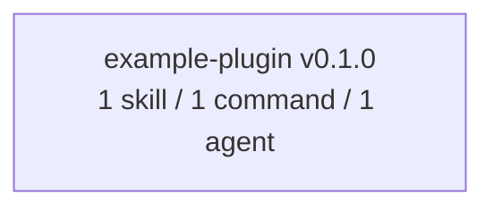

# Plugin dependency graph

How the plugins in this marketplace relate to each other: what each one declares
in its manifest, and how they compose at runtime.

## Declared dependencies (`plugin.json`)

A plugin can depend on another plugin in the same marketplace by listing it in a
`dependencies` field with a SemVer range, for example:

```json
{
  "name": "my-plugin",
  "version": "1.0.0",
  "dependencies": ["example-plugin@^0.1.0"]
}
```

Arrows point from the dependent plugin to its dependency; edge labels are the
SemVer ranges from the `dependencies` field.



## Current state

No plugin declares a dependency yet — `example-plugin` is self-contained. Update
this graph whenever a plugin gains or drops a dependency, and keep the version
labels in sync with each plugin's manifest.

## Rules

- Depend only on plugins within this marketplace. Cross-marketplace dependencies
  require `allowCrossMarketplaceDependenciesOn` in `marketplace.json` and are not
  used here.
- Constrain dependency versions with SemVer ranges so a dependency update cannot
  silently break the dependent plugin.
- Avoid dependency cycles; `claude plugin validate .` reports them.
